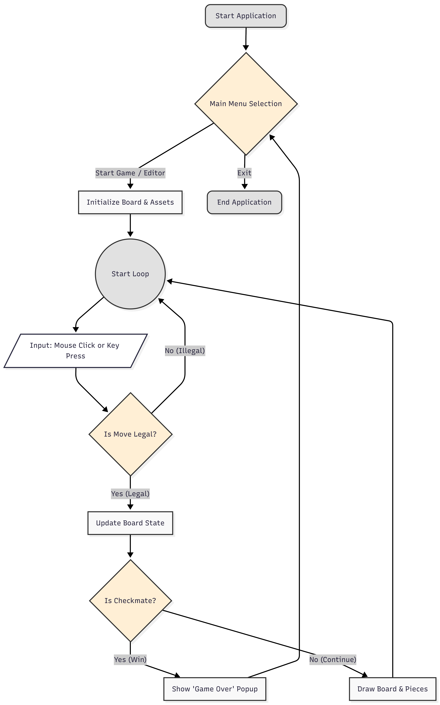
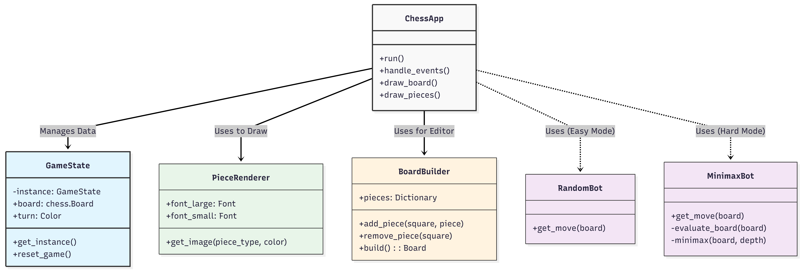
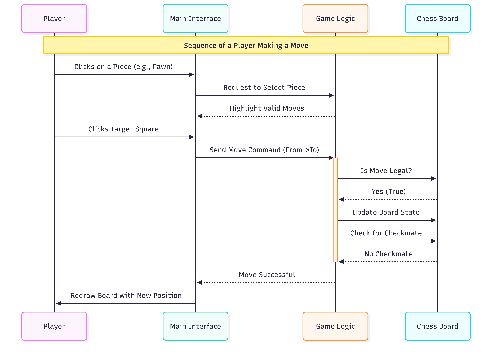

# ♟️ Smart Chess Game

**Course:** Advanced Software System Analysis and Design  
**University:** Southwest University of Science and Technology  
**School:** School of Computer Science and Technology  

**Author:** Hasan Md Rakibul  
**Student ID:** 7420250936  

---

## 📌 Project Overview

The **Smart Chess Game** is a lightweight, offline desktop chess application developed in **Python**.  
This project demonstrates how **software architecture principles**, **object-oriented programming**, and **artificial intelligence techniques** can be applied to a real-world game system.

Unlike heavy commercial chess engines, this system focuses on:
- Educational clarity
- Clean and modular architecture
- Offline usability
- Maintainable and extensible code design

The system supports **Player vs Player**, **Player vs AI**, and a **Puzzle Editor** for learning and practice.

---

## 🧠 Key Features

- ♜ Player vs Player (Local)
- 🤖 Player vs AI  
  - Easy Mode: Random AI  
  - Hard Mode: Minimax AI
- 🧩 Puzzle Editor (Custom board setup)
- 💾 Save & Load game state (JSON)
- ⚠️ Visual assistance (legal moves, check warning)
- 🎨 Multiple UI themes (Classic & High Contrast)
- 🧱 Clean architecture using software design patterns

---

## 🖼️ Screenshots & Diagrams

### 📊 Use Case Diagram


### 🔄 System Flowchart


### 🧩 Class Diagram


### 🔁 Sequence Diagram


### ⚠️ Check Warning UI


### 🏆 Win Popup Screen


---

## 🏗️ System Architecture

The system follows a **modified Model–View–Controller (MVC)** architecture.

### Model (Data Layer)
- `core/game_state.py`
- Stores board state, timers, turns, and move history
- Implemented using the **Singleton Pattern** to ensure a single shared game state

### View (UI Layer)
- `main.py`, `ui/components.py`, `pieces/piece_factory.py`
- Responsible for rendering the chessboard, pieces, UI components, and themes

### Controller (Input Layer)
- Handles mouse clicks, keyboard input, and user interactions
- Updates the Model and triggers UI refresh

---

## 📁 Project Structure

        ChessMaster_Project/
        │
        ├── ai/ # AI logic (Strategy Pattern)
        │ ├── random_bot.py
        │ ├── minimax_bot.py
        │ └── strategy_interface.py
        │
        ├── core/ # Core game logic
        │ ├── game_state.py
        │ ├── events.py
        │ └── settings.py
        │
        ├── editor/ # Puzzle editor (Builder Pattern)
        │ └── board_builder.py
        │
        ├── pieces/ # Chess piece rendering
        │ └── piece_factory.py
        │
        ├── storage/ # Save / Load system
        │ └── serializer.py
        │
        ├── themes/ # UI themes (Abstract Factory)
        │ ├── assets.py
        │ └── theme_factory.py
        │
        ├── ui/ # UI components
        │ └── components.py
        │
        ├── assets/ # Images
        │ └── background.jpg
        │
        ├── main.py # Application entry point
        └── savegame.json # Saved game data


---

## 🧩 Design Patterns Used

### 1️⃣ Singleton Pattern
- **Used in:** `GameState`
- Ensures only one active game state exists
- Prevents data inconsistency across the application

### 2️⃣ Builder Pattern
- **Used in:** `BoardBuilder`
- Allows step-by-step construction of custom board positions
- Validates board before starting a game


### 3️⃣ Abstract Factory Pattern
- **Used in:** Theme system
- Creates families of related UI elements (board colors, highlights)
- Supports Classic and High-Contrast themes
- Allows theme switching without modifying rendering logic
- Improves modularity and maintainability

---

## 🧠 AI Implementation

### 🎯 Easy Mode – Random AI
- Selects a move randomly from all legal moves
- Designed for beginners
- No strategic evaluation

### ♞ Hard Mode – Minimax AI
- Uses the **Minimax algorithm with recursion**
- Search depth: 3
- Evaluates board positions using material-based scoring

#### Piece Evaluation Table

| Piece   | Value |
|--------|-------|
| Pawn   | 10    |
| Knight | 30    |
| Bishop | 30    |
| Rook   | 50    |
| Queen  | 90    |
| King   | 900   |

---

## ⚙️ Functional Requirements

- Legal move validation
- Turn-based gameplay
- AI difficulty selection
- Puzzle editor with validation
- Save and load game state
- Game over detection (Checkmate / Stalemate)

---

## 🚀 Non-Functional Requirements

- **Performance:** Smooth 60 FPS gameplay
- **Usability:** Intuitive mouse-based controls
- **Reliability:** Graceful handling of invalid inputs
- **Availability:** Fully offline, no internet required

---

## ⚠️ Limitations

- Local gameplay only (no online multiplayer)
- No AI opening book
- No post-game analysis or replay mode
- 2D graphics only (no 3D effects)

---

## 🔮 Future Enhancements

- 🌐 Online multiplayer using socket programming
- 📈 Teacher / analysis mode
- 🔊 Sound effects
- 📚 Opening book integration
- ♻️ Replay and move analysis system

---

## ▶️ How to Run

```bash
pip install pygame python-chess
python main.py
